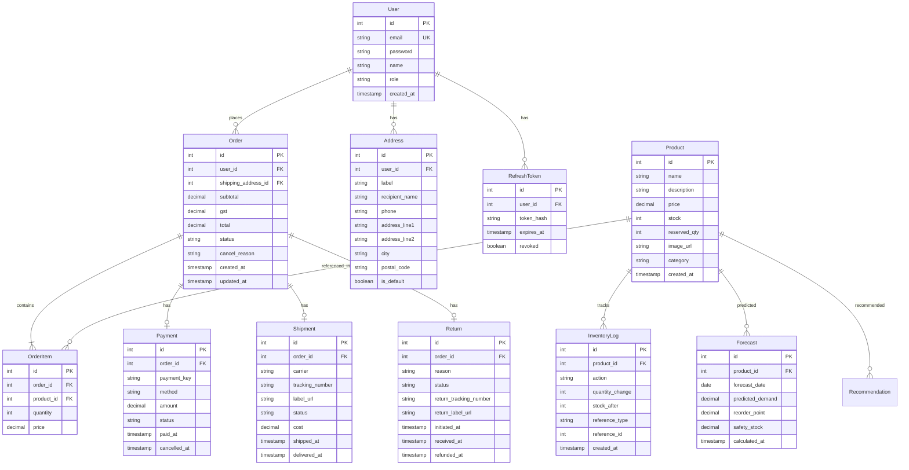

# Domain Entities — Backend Unit

## Entity Relationship Diagram

## Entity 상세

### User
- `role`: ENUM('admin', 'customer') — 기존 유지
- Admin 세부 역할 (operations_manager, inventory_manager, finance_manager)은 role 필드 확장으로 처리

### Product
- `reserved_qty`: 주문 생성시 예약된 수량 (available = stock - reserved_qty)
- `category`: Phase 3 추천 엔진에서 사용

### Order.status
- 유효 값: pending, confirmed, processing, picked, packed, shipped, delivered, cancelled, on_hold, backordered, return_initiated, return_received, refunded, exchanged

### Payment.status
- 유효 값: pending, succeeded, failed, cancelled, refunded, partial_refunded

### Shipment.status
- 유효 값: label_created, picked_up, in_transit, out_for_delivery, delivered, exception

### Return.status
- 유효 값: initiated, label_generated, in_transit, received, inspected, refunded, exchanged, rejected
