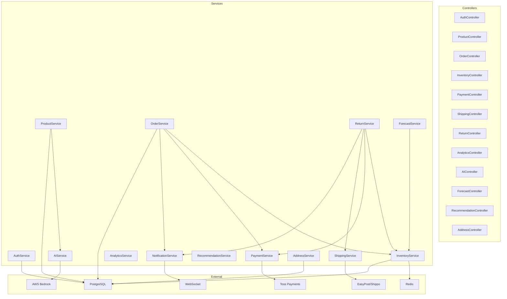

# Component Dependencies

## Dependency Diagram

## Dependency Matrix

| Service | Depends On |
|---|---|
| AuthService | UserRepository, Redis (refresh tokens) |
| ProductService | ProductRepository, AIService |
| OrderService | OrderRepository, InventoryService, PaymentService, NotificationService |
| InventoryService | InventoryRepository, Redis (cache) |
| PaymentService | TossPaymentsClient, OrderService (callback) |
| ShippingService | ShippingCarrierClient, OrderService (callback) |
| ReturnService | ReturnRepository, InventoryService, PaymentService, ShippingService, NotificationService |
| AnalyticsService | DB Read queries |
| AIService | BedrockClient, InventoryRepository, OrderRepository |
| ForecastService | OrderRepository, InventoryRepository |
| RecommendationService | OrderRepository |
| NotificationService | WebSocketServer |
| AddressService | AddressRepository |
| MarketplaceService (P4) | CoupangWingClient, OrderService, InventoryService |
| ERPIntegrationService (P4) | ERPAdapter, OrderRepository |

## Communication Patterns
- **Phase 1~3**: 동기 메서드 호출 (단일 프로세스 내)
- **Phase 4**: SQS/EventBridge 비동기 이벤트 (Microservices 간)
- **External**: REST API (Toss, EasyPost, Coupang), SDK (Bedrock)
- **Real-time**: WebSocket (클라이언트 알림)
