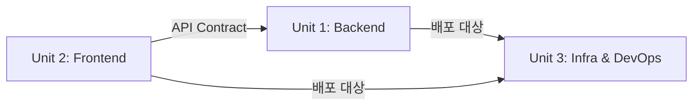

# Unit of Work Dependencies

## 구현 순서
**완전 병렬** — 3개 unit 동시 진행. API contract (OpenAPI spec)를 사전 합의하여 통합 리스크 최소화.

## Dependency Diagram

## Dependency Matrix

| Unit | Depends On | Dependency Type | 관리 방법 |
|---|---|---|---|
| Frontend (FE) | Backend (BE) | API Contract (REST + WebSocket) | OpenAPI spec 사전 정의, mock server로 독립 개발 |
| Backend (BE) | Infra (INFRA) | 배포 환경 (RDS, Redis, ECS) | 로컬 Docker Compose로 독립 개발, Infra 완료 후 배포 |
| Frontend (FE) | Infra (INFRA) | 배포 환경 (CloudFront, S3, ECS) | Vite dev server로 독립 개발, Infra 완료 후 배포 |
| Infra (INFRA) | 없음 | 독립 | 가장 먼저 완료 가능 |

## 통합 포인트

### API Contract (FE ↔ BE)
- REST API endpoint 목록 및 request/response 스키마
- WebSocket 이벤트 목록 및 payload 스키마
- 인증 토큰 형식 (JWT)

### 배포 Contract (BE/FE ↔ INFRA)
- Docker 이미지 형식 (ECR)
- 환경 변수 목록 (DB URL, Redis URL, API keys)
- 포트 매핑 (API: 3000, Frontend: 80)
- 헬스체크 endpoint (GET /health)

## 병렬 개발 전략

| Unit | 독립 개발 환경 | 통합 시점 |
|---|---|---|
| Backend | 로컬 PostgreSQL + Redis (Docker Compose) | Infra 완료 후 ECS 배포 |
| Frontend | Vite dev server + API mock/proxy | BE API 안정화 후 통합 테스트 |
| Infra | Terraform plan/apply (dev 환경) | BE/FE Docker 이미지 준비 후 배포 |
