# Execution Plan

## Detailed Analysis Summary

### Transformation Scope
- **Transformation Type**: Architectural (Monolith → Microservices, SQLite → PostgreSQL, EC2 → ECS Fargate)
- **Primary Changes**: DB 마이그레이션, 보안 강화, 실시간 기능, 결제/배송 통합, AI 확장, Microservices 분해
- **Related Components**: packages/api (전면 리팩토링), packages/frontend (Tailwind + 신규 페이지), 신규 인프라 (Terraform)

### Change Impact Assessment
- **User-facing changes**: Yes — 셀프서비스 포털, 결제, 배송 추적, AI 추천, 실시간 알림
- **Structural changes**: Yes — 서비스 레이어 도입, Microservices 분해, Event Bus
- **Data model changes**: Yes — SQLite→PostgreSQL, 신규 테이블 (addresses, returns, payments, shipping)
- **API changes**: Yes — 신규 endpoint 다수 (결제, 배송, 반품, 추천, AI Q&A)
- **NFR impact**: Yes — 성능(Redis), 보안(Helmet, rate limit), 모니터링(CloudWatch)

### Component Relationships
```
packages/api (Primary)
  ├── PostgreSQL (신규 — SQLite 대체)
  ├── Redis (신규 — 캐싱/세션)
  ├── Toss Payments (신규 — 결제)
  ├── EasyPost/Shippo (신규 — 배송)
  ├── AWS Bedrock Claude (확장 — AI Q&A)
  ├── SQS + EventBridge (Phase 4 — 이벤트 버스)
  └── Coupang Wing API (Phase 4 — Marketplace)

packages/frontend (Secondary)
  ├── Tailwind CSS (신규 — 스타일링)
  ├── WebSocket (신규 — 실시간)
  ├── Toss Payments SDK (신규 — 결제 UI)
  └── 신규 페이지 (셀프서비스, 반품, 주소록 등)

infrastructure/ (신규)
  └── Terraform (VPC, ECS, RDS, ElastiCache, ALB, S3)
```

### Risk Assessment
- **Risk Level**: High (시스템 전반 변경, DB 마이그레이션, 다수 외부 통합)
- **Rollback Complexity**: Moderate (Phase별 점진적 배포로 위험 분산)
- **Testing Complexity**: Complex (Unit + Integration 테스트 필요)

---

## Workflow Visualization

```mermaid
flowchart TD
    Start(["User Request"])
    
    subgraph INCEPTION["INCEPTION PHASE"]
        WD["Workspace Detection<br/>COMPLETED"]
        RE["Reverse Engineering<br/>COMPLETED"]
        RA["Requirements Analysis<br/>COMPLETED"]
        US["User Stories<br/>COMPLETED"]
        WP["Workflow Planning<br/>COMPLETED"]
        AD["Application Design<br/>EXECUTE"]
        UG["Units Generation<br/>EXECUTE"]
    end
    
    subgraph CONSTRUCTION["CONSTRUCTION PHASE"]
        FD["Functional Design<br/>EXECUTE per-unit"]
        NFRA["NFR Requirements<br/>EXECUTE per-unit"]
        NFRD["NFR Design<br/>EXECUTE per-unit"]
        ID["Infrastructure Design<br/>EXECUTE per-unit"]
        CG["Code Generation<br/>EXECUTE per-unit"]
        BT["Build and Test<br/>EXECUTE"]
    end
    
    Start --> WD
    WD --> RE --> RA --> US --> WP
    WP --> AD --> UG
    UG --> FD
    FD --> NFRA --> NFRD --> ID --> CG
    CG -.->|Next Unit| FD
    CG --> BT
    BT --> End(["Complete"])
    
    style WD fill:#4CAF50,stroke:#1B5E20,stroke-width:3px,color:#fff
    style RE fill:#4CAF50,stroke:#1B5E20,stroke-width:3px,color:#fff
    style RA fill:#4CAF50,stroke:#1B5E20,stroke-width:3px,color:#fff
    style US fill:#4CAF50,stroke:#1B5E20,stroke-width:3px,color:#fff
    style WP fill:#4CAF50,stroke:#1B5E20,stroke-width:3px,color:#fff
    style AD fill:#FFA726,stroke:#E65100,stroke-width:3px,stroke-dasharray: 5 5,color:#000
    style UG fill:#FFA726,stroke:#E65100,stroke-width:3px,stroke-dasharray: 5 5,color:#000
    style FD fill:#FFA726,stroke:#E65100,stroke-width:3px,stroke-dasharray: 5 5,color:#000
    style NFRA fill:#FFA726,stroke:#E65100,stroke-width:3px,stroke-dasharray: 5 5,color:#000
    style NFRD fill:#FFA726,stroke:#E65100,stroke-width:3px,stroke-dasharray: 5 5,color:#000
    style ID fill:#FFA726,stroke:#E65100,stroke-width:3px,stroke-dasharray: 5 5,color:#000
    style CG fill:#4CAF50,stroke:#1B5E20,stroke-width:3px,color:#fff
    style BT fill:#4CAF50,stroke:#1B5E20,stroke-width:3px,color:#fff
    style INCEPTION fill:#BBDEFB,stroke:#1565C0,stroke-width:3px,color:#000
    style CONSTRUCTION fill:#C8E6C9,stroke:#2E7D32,stroke-width:3px,color:#000
    style Start fill:#CE93D8,stroke:#6A1B9A,stroke-width:3px,color:#000
    style End fill:#CE93D8,stroke:#6A1B9A,stroke-width:3px,color:#000
    linkStyle default stroke:#333,stroke-width:2px
```



Text Alternative:
```
INCEPTION: WD(완료) → RE(완료) → RA(완료) → US(완료) → WP(완료) → AD(실행) → UG(실행)
CONSTRUCTION: [Per-Unit] FD(실행) → NFRA(실행) → NFRD(실행) → ID(실행) → CG(실행) → BT(실행)
```

---

## Phases to Execute

### INCEPTION PHASE
- [x] Workspace Detection (COMPLETED)
- [x] Reverse Engineering (COMPLETED)
- [x] Requirements Analysis (COMPLETED)
- [x] User Stories (COMPLETED)
- [x] Workflow Planning (COMPLETED)
- [ ] Application Design — EXECUTE
  - **Rationale**: 신규 서비스 레이어, 다수 신규 컴포넌트 (결제, 배송, AI, 알림), Microservices 경계 정의 필요
- [ ] Units Generation — EXECUTE
  - **Rationale**: 4단계 Phase에 걸친 복잡한 시스템으로 다수 unit 분해 필요

### CONSTRUCTION PHASE (Per-Unit Loop)
- [ ] Functional Design — EXECUTE (per-unit)
  - **Rationale**: 각 unit별 데이터 모델, 비즈니스 로직, API 상세 설계 필요
- [ ] NFR Requirements — EXECUTE (per-unit)
  - **Rationale**: 성능, 보안, 확장성 요구사항이 unit별로 다름
- [ ] NFR Design — EXECUTE (per-unit)
  - **Rationale**: NFR 패턴 (캐싱, rate limiting, 로깅) unit별 적용 설계
- [ ] Infrastructure Design — EXECUTE (per-unit)
  - **Rationale**: ECS Fargate, RDS, ElastiCache, SQS 등 인프라 매핑 필요
- [ ] Code Generation — EXECUTE (per-unit, ALWAYS)
  - **Rationale**: 구현 필수
- [ ] Build and Test — EXECUTE (ALWAYS)
  - **Rationale**: 빌드/테스트 지침 필수

### OPERATIONS PHASE
- [ ] Operations — PLACEHOLDER

---

## Extension Compliance
| Extension | Status | Enforcement |
|---|---|---|
| security/baseline/security-baseline.md | Enabled | 모든 stage에서 SECURITY-01~15 blocking constraint 적용 |

---

## Success Criteria
- **Primary Goal**: Inventrix를 프로덕션 수준의 현대적 e-commerce 플랫폼으로 현대화
- **Key Deliverables**: PostgreSQL 마이그레이션, 보안 강화, 실시간 기능, 결제/배송 통합, AI 확장, Microservices 아키텍처, Coupang 통합, Terraform IaC
- **Quality Gates**: SECURITY-01~15 전체 준수, Unit+Integration 테스트, API p95 < 200ms
