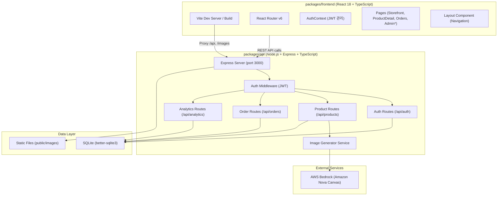
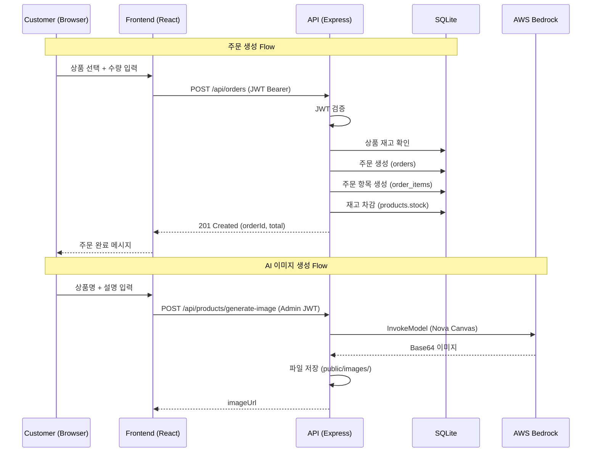

# System Architecture

## System Overview
Inventrix는 pnpm workspace 기반 monorepo로 구성된 full-stack e-commerce 플랫폼입니다. Frontend(React+TypeScript)와 Backend(Node.js+Express+TypeScript)로 구성되며, SQLite를 데이터 저장소로, AWS Bedrock를 AI 이미지 생성에 사용합니다.

## Architecture Diagram

## Component Descriptions

### packages/frontend
- **Purpose**: React 기반 SPA (Single Page Application)
- **Responsibilities**: UI 렌더링, 클라이언트 라우팅, 인증 상태 관리, API 호출
- **Dependencies**: react, react-dom, react-router-dom
- **Type**: Application (Frontend)

### packages/api
- **Purpose**: RESTful API 서버
- **Responsibilities**: 비즈니스 로직, 데이터 접근, 인증/인가, AI 이미지 생성
- **Dependencies**: express, better-sqlite3, bcrypt, jsonwebtoken, cors, @aws-sdk/client-bedrock-runtime
- **Type**: Application (Backend)

## Data Flow

## Integration Points
- **External APIs**: AWS Bedrock Runtime (Amazon Nova Canvas v1:0) - 상품 이미지 생성
- **Databases**: SQLite (better-sqlite3) - 모든 데이터 저장 (users, products, orders, order_items)
- **Third-party Services**: 없음 (결제, 배송 등 미통합)

## Infrastructure Components
- **CDK Stacks**: 없음 (IaC 미구성)
- **Deployment Model**: deploy.sh 스크립트 기반 AWS 배포 (EC2 추정)
- **Networking**: 미정의 (로컬 개발 환경 중심)
