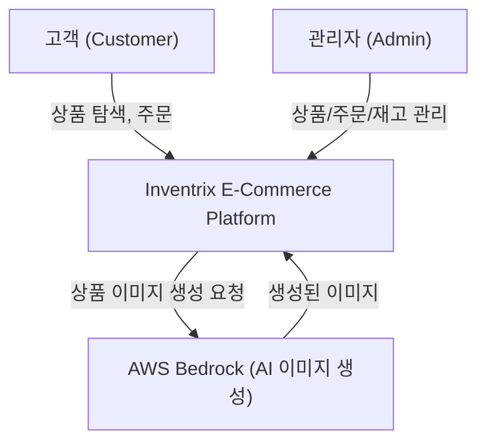

# Business Overview

## Business Context Diagram

## Business Description
- **Business Description**: Inventrix는 전자제품 중심의 full-stack e-commerce 플랫폼으로, 가상 상점(storefront), 상품 카탈로그 관리, 주문 처리, 재고 관리, 비즈니스 분석 기능을 제공합니다. Admin과 Customer 두 가지 역할 기반 인증을 지원합니다.
- **Business Transactions**:
  1. **상품 탐색 (Product Browsing)**: 고객이 상점에서 상품 목록을 조회하고 상세 정보를 확인
  2. **주문 생성 (Order Placement)**: 인증된 고객이 상품을 선택하고 수량을 지정하여 주문 (GST 10% 자동 계산)
  3. **주문 관리 (Order Management)**: Admin이 주문 상태를 변경 (pending → processing → shipped → delivered / cancelled)
  4. **상품 관리 (Product Management)**: Admin이 상품 CRUD 수행 (생성, 조회, 수정, 삭제)
  5. **AI 이미지 생성 (AI Image Generation)**: Admin이 AWS Bedrock (Amazon Nova Canvas)를 통해 상품 이미지 자동 생성
  6. **재고 관리 (Inventory Management)**: Admin이 재고 현황 조회 (재고 부족/품절 상태 표시)
  7. **비즈니스 분석 (Business Analytics)**: Admin이 매출, 주문 수, 인기 상품, 주문 상태별 통계 조회
  8. **사용자 인증 (User Authentication)**: 로그인/회원가입을 통한 JWT 기반 인증
- **Business Dictionary**:
  - **GST (Goods and Services Tax)**: 상품 및 서비스세, 소계의 10%로 자동 계산
  - **Low Stock**: 재고 10개 미만인 상품
  - **Out of Stock**: 재고 0개인 상품
  - **Storefront**: 고객이 상품을 탐색하는 가상 상점 페이지

## Component Level Business Descriptions

### packages/api (Backend API)
- **Purpose**: 모든 비즈니스 로직과 데이터 관리를 담당하는 REST API 서버
- **Responsibilities**: 사용자 인증, 상품 CRUD, 주문 처리 및 재고 차감, 분석 데이터 집계, AI 이미지 생성

### packages/frontend (Frontend Application)
- **Purpose**: 고객과 관리자를 위한 웹 사용자 인터페이스
- **Responsibilities**: 상품 탐색 UI, 주문 UI, Admin Dashboard, 상품/주문/재고 관리 UI, 인증 UI
