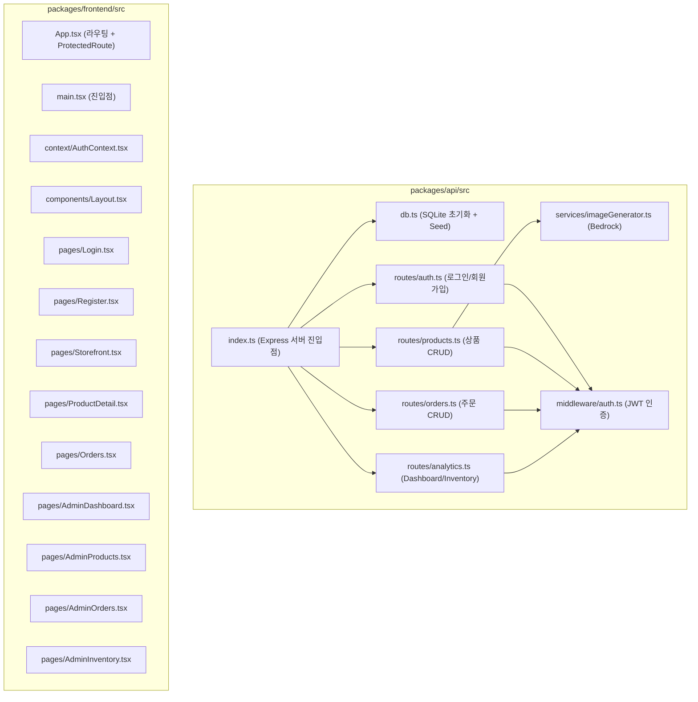

# Code Structure

## Build System
- **Type**: pnpm (workspace monorepo)
- **Configuration**:
  - Root: `package.json` (workspace 정의), `pnpm-workspace.yaml`, `pnpm-lock.yaml`
  - Frontend: Vite + TypeScript (`vite.config.ts`, `tsconfig.json`)
  - Backend: tsx (dev), tsc (build) (`tsconfig.json`)

## Key Classes/Modules

### Existing Files Inventory

**Backend (packages/api/src)**:
- `index.ts` - Express 서버 설정 및 라우트 등록, CORS, static file serving
- `db.ts` - SQLite DB 초기화, 테이블 생성, 시드 데이터 (users 2명, products 24개)
- `middleware/auth.ts` - JWT 인증 middleware (authenticate, requireAdmin, generateToken)
- `routes/auth.ts` - 로그인 (POST /login), 회원가입 (POST /register)
- `routes/products.ts` - 상품 CRUD (GET, GET/:id, POST, PUT/:id, DELETE/:id, POST /generate-image)
- `routes/orders.ts` - 주문 조회 (GET), 상세 (GET/:id), 생성 (POST), 상태 변경 (PATCH/:id/status)
- `routes/analytics.ts` - Dashboard 데이터 (GET /dashboard), 재고 현황 (GET /inventory)
- `services/imageGenerator.ts` - AWS Bedrock Nova Canvas 이미지 생성

**Frontend (packages/frontend/src)**:
- `main.tsx` - React 앱 진입점
- `App.tsx` - React Router 설정, ProtectedRoute 컴포넌트
- `index.css` - 글로벌 스타일 (gradient 배경, 버튼/입력 스타일)
- `context/AuthContext.tsx` - 인증 상태 관리 (login, register, logout, localStorage)
- `components/Layout.tsx` - 네비게이션 바 + Outlet 레이아웃
- `pages/Login.tsx` - 로그인 폼
- `pages/Register.tsx` - 회원가입 폼
- `pages/Storefront.tsx` - 상품 목록 그리드 (공개)
- `pages/ProductDetail.tsx` - 상품 상세 + 주문 버튼
- `pages/Orders.tsx` - 고객 주문 내역
- `pages/AdminDashboard.tsx` - Admin 대시보드 (매출, 주문, 인기상품)
- `pages/AdminProducts.tsx` - 상품 관리 (CRUD + AI 이미지 생성)
- `pages/AdminOrders.tsx` - 주문 관리 (상태 변경)
- `pages/AdminInventory.tsx` - 재고 현황 테이블

## Design Patterns

### Repository Pattern (Implicit)
- **Location**: routes/*.ts에서 직접 DB 쿼리
- **Purpose**: 데이터 접근 (별도 repository 레이어 없이 route에서 직접 수행)
- **Implementation**: better-sqlite3 prepare/run/get/all 직접 호출

### Context Pattern (React)
- **Location**: context/AuthContext.tsx
- **Purpose**: 전역 인증 상태 관리
- **Implementation**: React Context + useState + localStorage

### Protected Route Pattern
- **Location**: App.tsx (ProtectedRoute 컴포넌트)
- **Purpose**: 인증/인가 기반 라우트 보호
- **Implementation**: useAuth() hook으로 user 확인, 미인증시 /login redirect

### Middleware Pattern
- **Location**: middleware/auth.ts
- **Purpose**: JWT 토큰 검증 및 역할 기반 접근 제어
- **Implementation**: Express middleware (authenticate, requireAdmin)

## Critical Dependencies

### Backend
- **express** (^4.18.2) - HTTP 서버 프레임워크
- **better-sqlite3** (^9.2.2) - SQLite 동기식 DB 드라이버
- **bcrypt** (^5.1.1) - 비밀번호 해싱
- **jsonwebtoken** (^9.0.2) - JWT 토큰 생성/검증
- **cors** (^2.8.5) - Cross-Origin Resource Sharing
- **@aws-sdk/client-bedrock-runtime** (^3.700.0) - AWS Bedrock AI 모델 호출

### Frontend
- **react** (^18.2.0) - UI 라이브러리
- **react-dom** (^18.2.0) - React DOM 렌더링
- **react-router-dom** (^6.21.1) - 클라이언트 라우팅
